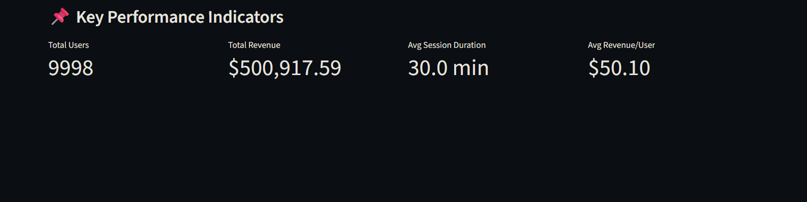
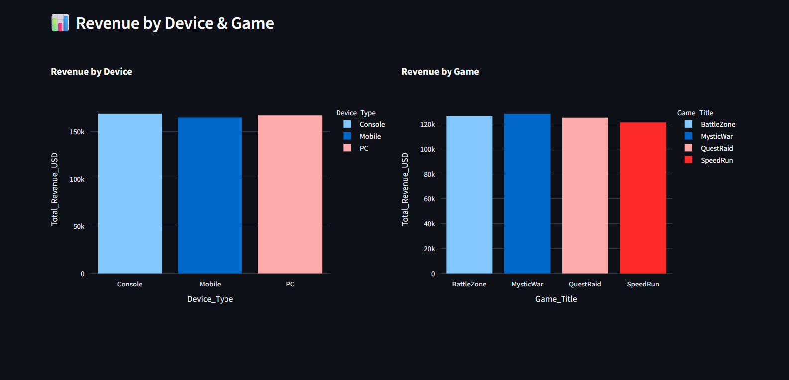
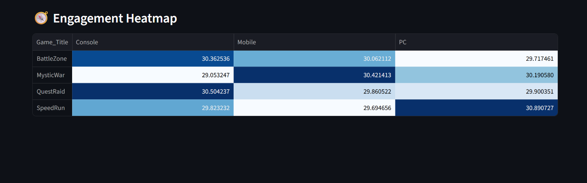
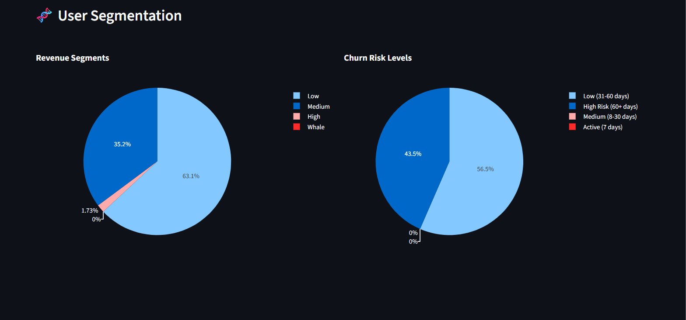

# 🎮 Matiks Gaming Analytics Dashboard

An interactive Streamlit dashboard that analyzes user behavior and monetization data. Built as a product analytics showcase for Matiks.

---

## 🔥 Features

### 📊 Visual & Revenue Analytics

- Total Revenue, Avg. Session Duration, Revenue per User
- Revenue breakdown by device type and game title
- Filters: Country, Device, Game, Signup Date, Revenue Range

### 🧬 User Segmentation

- Revenue tiers: Low, Medium, High, Whale
- Churn risk: Active, Medium, Low, High Risk
- Engagement heatmaps by game and device

### 🧠 UX & Interactivity

- Multi-tab layout (Overview, Revenue, Behavior, Segmentation, Raw)
- Gradient-styled, responsive UI
- Export filtered data as CSV

---

## 🖼️ Preview

### 📌 Dashboard KPIs



### 💰 Revenue Breakdown



### 🧭 Engagement Heatmap



### 🧬 User Segmentation



---

## 🛠️ Tech Stack

| Tool       | Purpose                      |
| ---------- | ---------------------------- |
| Streamlit  | Interactive frontend UI      |
| Pandas     | Data manipulation            |
| Plotly     | Interactive charts           |
| NumPy      | Numerical operations         |
| Matplotlib | Static/backup visualizations |

---

## 🚀 Run It Locally

Clone the repo and run the app:

```bash
git clone https://github.com/your-username/matiks-dashboard.git
cd matiks-dashboard
pip install -r requirements.txt
streamlit run app.py
```
